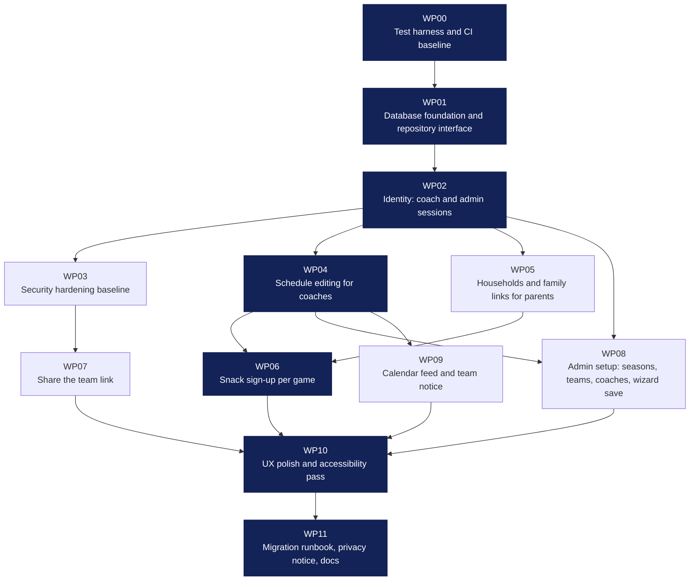

# GoodSport v2: one PR, sequential builders, parallel verifiers

> Hand this whole file to the conductor agent. It contains the goal, the rules for every role, and the work graph reference. The graph itself is `docs/swarm/graph.json`; the runnable orchestration is `docs/swarm/workflow.js`; the reviews that shaped the graph are in `docs/reviews/`.

## Goal

Deliver **one pull request** against `main` that takes goodsport.team from a read-only, JSON-seeded prototype to a site three kinds of people can actually use without help:

- **Admin** sets up a team and season once, invites coaches, and shares the parent link.
- **Coaches** edit the practice and game schedule from a phone, see who's bringing snack, take attendance, run Game Day, and message families.
- **Parents** open a link from a text, see the next event and where to go, and sign up for a snack slot for any game. No passwords for parents, ever.

Everything must remain sport-agnostic (one `SportTemplate` per sport; no `if (sport === …)` in components or prompts) and reusable next season with a different team.

## One branch, one builder at a time

This is a single-developer project. The swarm builds **directly on the deploy branch** (`claude/soccer-team-management-site-8kh6n9`, which Netlify publishes to goodsport.team). That sets three rules the graph is built around:

- **Every node leaves the site working.** Each node's acceptance list includes "existing pages render identically" or an equivalent; half-built features are hidden behind data (no rows) rather than flags.
- **Commit locally, push only after verification.** The builder commits; the conductor pushes only once every verifier passes. Production never receives an unverified commit.
- **Tests run before the build on Netlify.** `netlify.toml` runs typecheck, lint, and the unit suite ahead of `next build`, so a red push keeps the previous deploy live. CI runs the same plus Playwright.

A single active builder removes merge conflicts entirely. Parallelism is spent where it's free: read-only verifiers.

## The work graph (summary)

`graph.json` is the source of truth. Each node is a work package with `id`, `title`, `goal`, `owns` (paths it may write), `exports` (contracts downstream nodes consume), `dependsOn`, `acceptance`, and `estimate` (relative size, used for the critical path). The build order is the topological sort; ties break alphabetically so the order is deterministic.

Dark nodes are the critical path (WP00 → WP01 → WP02 → WP04 → WP06 → WP10 → WP11). Total size 42 units; the critical path is 27, so with one builder at a time the remaining 15 units of side branches (WP03, WP05, WP07, WP08, WP09) are slotted into the order where their dependencies allow. Cut set: {WP00, WP01, WP02}. Everything depends on them; nothing ships without them.

## Conductor rules

1. Load `graph.json`. Compute the topological order and the critical path. Announce both.
2. Load `state.json` if it exists. Skip nodes marked `done`. If a node is `verifying` or `building`, restart that node from the builder.
3. For each node in order: run **one** builder. When it returns, run **all** applicable verifiers **in parallel**. If any verifier fails, send the concatenated failures back to the same builder role (fresh agent, same node) for a fix round. Maximum three builder rounds per node. If still failing, mark the node `blocked`, stop, and report; a human decides. When all verifiers pass, run the **publisher** step: re-run `npm run test:ci`, mark the node `done` in `state.json`, commit that, and push.
4. Never edit files yourself. Never run two builders at once. Never skip verification.
5. After the last node, run the integrator.

## Builder rules

You are the only writer. Read the node in `graph.json` before touching anything.

- **Stay in your lane.** Write only under the node's `owns` paths. If a contract forces a touch elsewhere, keep it minimal and explain it in the commit body.
- **Honor contracts.** Export exactly what `exports` lists, with the names given. Consume predecessors' exports; never redefine them.
- **Repo rules apply** (from `CLAUDE.md`): sport-specific behavior lives in `src/lib/sports/templates.ts`; data goes through `src/lib/data/repo.ts`; public pages use contact-free projections; AI goes through the provider and never invents contacts.
- **Privacy first.** Children's names beyond first name + last initial, guardian phone/email, DOB, and medical notes never appear in a public route, a public JSON payload, a log line, or a commit. The repo is public.
- **Server-side authorization on every write.** UI hiding is not a control. Every route handler and server action checks the caller's role for the team before reading or writing.
- **Simple beats clever.** No new dependency without a one-line justification in the commit body. No feature flags for things that should just work.
- **Tests are part of the node.** Add unit tests for pure logic and at least one request-level test per new route handler. Keep `npm run typecheck && npm run lint && npm test && npm run build` green.
- **Commit format.** Subject `"<node id>: <node title>"`. Body: what changed, contracts exported, anything deviating from the spec and why. One commit per node round (a fix round may add a second commit with subject `"<node id>: fix — <what>"`).
- **Tests are not optional.** `docs/TESTING.md` is binding. Each acceptance item gets an automated test in the matching layer (unit, contract, request, privacy, e2e); list the test file next to each item in your report. Authorization is tested as the five-role matrix. No `.skip(` or `.only(`.
- **State.** Update `docs/swarm/state.json` before committing.
- **Do not push.** Commit locally with the node id in the subject. The conductor pushes after verification.
- **Report.** Return: files changed, how each acceptance item was met, anything not done and why. Do not pad.

## Verifier rules

You are read-only. You have the builder's report, the diff, and the node spec.

- Verify **claims against evidence**: run the tests, grep for the exported symbols, hit the routes with curl where a server is needed, open the page at phone width if the lens is UX.
- A **failure** is concrete and reproducible, with `file:line` and the command or steps that show it. Anything else is a **note**.
- Do not re-review earlier nodes except where this node's diff touches them.
- Do not propose scope. If the spec is wrong, say so as a note; the conductor and the human decide.

### Verifier lenses

| id | Lens | What it checks |
|---|---|---|
| `contracts` | Contracts | Every `exports` symbol exists, is used by at least one consumer or test, and predecessors' contracts are consumed, not redefined. |
| `tests` | Checks | First: every acceptance item in the node maps to a named automated test, per `docs/TESTING.md`. Then `npm run test:ci` passes on the commit, `npm run test:e2e` passes for nodes that touch screens, `npm run test:contract` passes for nodes that touch the repository; no skipped or focused tests; authorization matrix present for every new write. |
| `security` | Security | Server-side authorization on writes; no PII in public routes or payloads; input validated with zod; no secrets or PII in logs; headers and cookies as specified in `docs/reviews/03-security.md`. |
| `ux` | Simplicity | The node's screens meet `docs/reviews/01-design-ux.md` §4 for the affected audience; tap targets ≥48px; works at 400px width; undo, not confirm dialogs; no developer copy in the UI. |
| `sport-agnostic` | Reuse | No sport branching in components or prompts; new behavior reads from `SportTemplate`; a T-ball team would work with the same code. |

## Integrator rules

Run the full check suite, write `docs/swarm/PR-DESCRIPTION.md` (summary, Mermaid of the graph, per-node changes with SHAs, Netlify environment variables and migration steps, how to test as admin/coach/parent, known gaps), commit, push. Do not open the PR; the human does.

## Work packages

Decisions the graph is built on (from `graph.json` → `decisions`):

- **Persistence:** Neon Postgres (Netlify DB) via Drizzle, behind the TeamRepo interface; the JSON file repo stays for local dev, tests, and seeding. Chosen over Netlify Blobs because the identity model (users, sessions, tokens, households, audit) is relational and the PR is meant to be the durable foundation.
- **Identity:** Coaches/admin: email 6-digit code or link (Resend, console fallback in dev) issuing server-side sessions. Parents: signed family links texted by the coach, plus a claim-by-masked-email fallback. No passwords anywhere. Legacy COACH_PASSCODE stays as a shim until both coaches have signed in.
- **Snack sign-up:** Generic Signup slots (role: snack) so volunteer sign-ups come free later; one slot per game; parent claim requires a household session; coach can assign/clear anything.
- **Branching:** Single developer, single branch: the swarm builds directly on the deploy branch. Every node must leave the site working (its acceptance includes existing pages rendering identically), builders commit locally, and a node is pushed only after its verifiers pass, so production only ever receives verified commits.
- **Testing:** docs/TESTING.md is binding. Every acceptance item maps to an automated test in the matching layer; the tests verifier fails a node otherwise.

| Node | Title | Depends on | Size | Owns (top-level) |
|---|---|---|---|---|
| WP00 | Test harness and CI baseline | — | 2 | tests, vitest.config.ts, vitest.contract.config.ts |
| WP01 | Database foundation and repository interface | WP00 | 5 | src/lib/db, src/lib/data/repo.ts, src/lib/data/getTeam.ts |
| WP02 | Identity: coach and admin sessions | WP01 | 5 | src/lib/auth, src/lib/auth.ts, src/proxy.ts |
| WP03 | Security hardening baseline | WP02 | 3 | next.config.ts, src/lib/ai, prompts |
| WP04 | Schedule editing for coaches | WP02 | 5 | src/app/team/[slug]/schedule, src/app/team/[slug]/events, src/actions/events.ts |
| WP05 | Households and family links for parents | WP02 | 4 | src/app/f, src/app/t/[code]/claim, src/app/api/family |
| WP06 | Snack sign-up per game | WP04, WP05 | 4 | src/actions/signups.ts, src/lib/signups, src/app/t/[code]/snacks |
| WP07 | Share the team link | WP03 | 2 | src/app/team/[slug]/share, src/components/ShareTeam.tsx, src/lib/qr.ts |
| WP08 | Admin setup: seasons, teams, coaches, wizard save | WP02, WP04 | 4 | src/app/admin, src/actions/admin.ts, src/components/SetupWizard.tsx |
| WP09 | Calendar feed and team notice | WP04 | 2 | src/app/t/[code]/calendar.ics, src/lib/ics.ts, src/actions/notice.ts |
| WP10 | UX polish and accessibility pass | WP06, WP07, WP08, WP09 | 4 | src/app/globals.css, src/components/AppShell.tsx, src/components/ui |
| WP11 | Migration runbook, privacy notice, docs | WP10 | 2 | docs, README.md, CLAUDE.md |

Build order (topological, ties alphabetical): **WP00 → WP01 → WP02 → WP03 → WP04 → WP05 → WP06 → WP07 → WP08 → WP09 → WP10 → WP11**.

Each node's full `goal`, `exports`, and `acceptance` list are in `graph.json`; the builder prompt template in `workflow.js` injects them verbatim.

## How to run it

1. Stay on the deploy branch. Make sure the working tree is clean and CI is green on the current head.
2. Set up a Neon database and `RESEND_API_KEY` for the builders to test against, or let WP01/WP02 use the local fallbacks.
3. Invoke the Workflow tool with `scriptPath: docs/swarm/workflow.js` and `args: { graph: <contents of graph.json>, branch: "claude/soccer-team-management-site-8kh6n9" }`. To resume after a stop, add `startAt: "<node id>"`.
4. When the integrator returns, `docs/swarm/PR-DESCRIPTION.md` doubles as the release note; open a PR to `main` from the same branch when you want a review surface, or merge when ready.

## Reviews that shaped this graph

- `docs/reviews/01-design-ux.md`: top 10 findings, the three feature sketches, the definition of simple.
- `docs/reviews/02-product-features.md`: feature gap table, persistence comparison, week-1 asks, non-goals.
- `docs/reviews/03-security.md`: ranked findings, threat model, requirements before parents can write.
- `docs/reviews/04-access-roles.md`: roles matrix, identity flows, data model, enforcement, migration.

